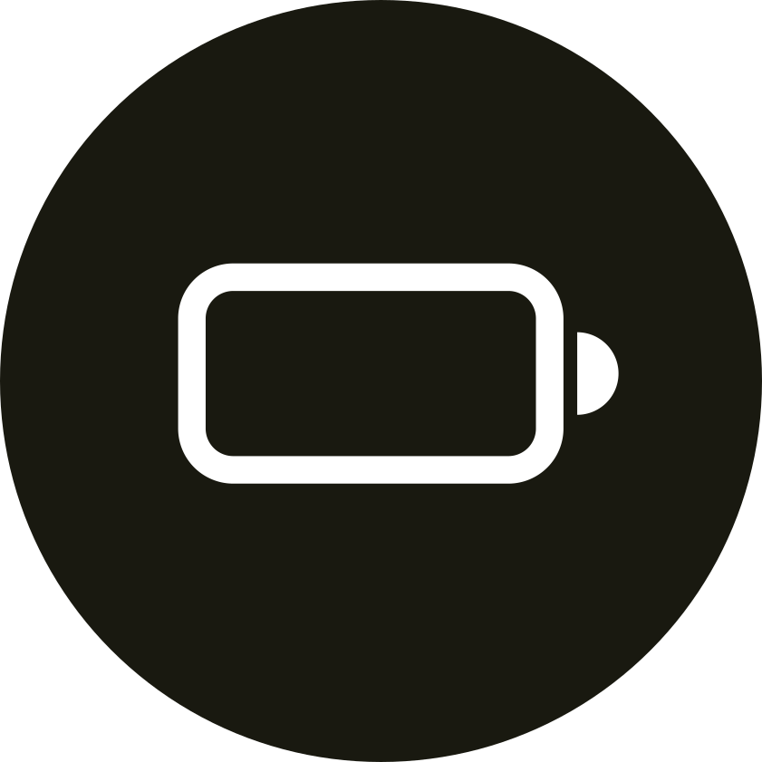

# Javabattery

## v1.0.4 (Improvements 🚀)

- Code refactoring 🧹
- Made some UI improvements 🎨

## v1.0.3 (Add new feature 🎉)

You can now set and manage the battery levels to be notified 📢

## v1.0.2 (Improvements 🚀)

The UI is now prebuilt instead of being built on the fly 🏗️ (the app is now 2x faster 🚀)

## v1.0.1 (Improvements 🚀)

Added error handling and configuration files 🤓

## v1.0.0 (Initial release 🎊)

Initial commit ✅
