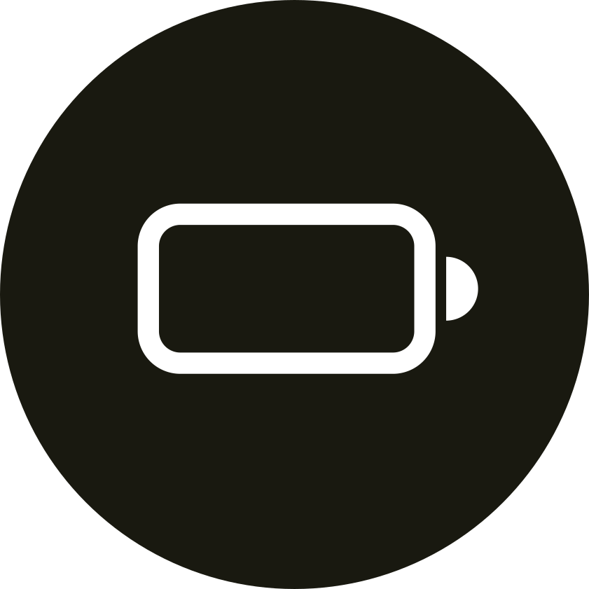
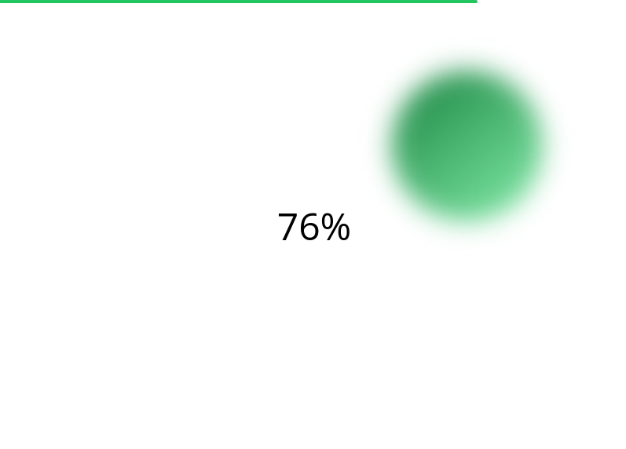

# Javabattery




&nbsp;&nbsp;&nbsp;&nbsp;

## Features

1. Nice UI (made with [TailwindCSS](https://tailwind.css))
2. Notifications on battery percentage (never get caught offguard again)
3. A moving blob (because why not - it is also an highlighter)
4. Battery percentage changes in realtime

## Pre-requisites

1. ImageMagick (see <https://imagemagick.org/script/download.php>) - for image conversions

## Setup

The commands I'll be using are for `pnpm`, but you can use `yarn` or `npm` if you want.

```bash
# Install dependencies and build icons used in the project

$ pnpm install
```

## Running

### Development

After running the command below a window open and the project will be running on <http://localhost:3000>

```bash
# Runs the development server and opens electron
$ pnpm dev
```

### Production

To build and package the application, run the following command:

```bash
# Builds the frontend and packages the app based on the
# current operating system (windows and linux are supported)

$ pnpm release
```

## TODOs

1. Add the ability for users to add custom battery levels for notifications
